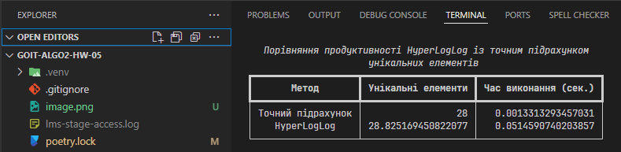

# Алгоритми роботи з великими даними

- Завдання 1. Перевірка унікальності паролів за допомогою фільтра Блума
- Завдання 2. Порівняння продуктивності HyperLogLog із точним підрахунком унікальних елементів

## Завдання 1. Перевірка унікальності паролів за допомогою фільтра Блума

Створіть функцію для перевірки унікальності паролів за допомогою фільтра Блума. Ця функція має визначати, чи використовувався пароль раніше, без необхідності зберігати самі паролі.

**Технічні умови**

1. Реалізуйте клас `BloomFilter`, який забезпечує додавання елементів до фільтра та перевірку наявності елемента у фільтрі.

2. Реалізуйте функцію `check_password_uniqueness`, яка використовує екземпляр `BloomFilter` та перевіряє список нових паролів на унікальність. Вона має повертати результат перевірки для кожного пароля.

3. Забезпечте коректну обробку всіх типів даних. Паролі слід обробляти просто як рядки, без хешування. Порожні або некоректні значення також мають бути враховані та оброблені належним чином.

4. Функція та клас мають працювати з великими наборами даних, використовуючи мінімум пам’яті.

**Критерії прийняття**

1. Клас `BloomFilter` реалізує логіку роботи з фільтром Блума (20 балів).

2. Функція `check_password_uniqueness` перевіряє нові паролі, використовуючи переданий фільтр (20 балів).

3. Код виконує приклад використання відповідно до очікуваних результатів (10 балів).

## Рішення завдання 1

[task_01.py](task_01.py)

## Завдання 2. Порівняння продуктивності HyperLogLog із точним підрахунком унікальних елементів

Створіть скрипт для порівняння точного підрахунку унікальних елементів та підрахунку за допомогою HyperLogLog.

**Технічні умови**

1. Завантажте набір даних із [реального лог-файлу](https://drive.google.com/file/d/13NUCSG7l_z2B7gYuQubYIpIjJTnwOAOb/view?usp=sharing)`lms-stage-access.log`, що містить інформацію про IP-адреси.

2. Реалізуйте метод для точного підрахунку унікальних IP-адрес за допомогою структури `set`.

3. Реалізуйте метод для наближеного підрахунку унікальних IP-адрес за допомогою HyperLogLog.

4. Проведіть порівняння методів за часом виконання.

**Критерії прийняття**

1. Метод завантаження даних обробляє лог-файл, ігноруючи некоректні рядки (10 балів).

2. Функція точного підрахунку повертає правильну кількість унікальних IP-адрес (10 балів).

3. HyperLogLog показує результат із прийнятною похибкою (10 балів).

4. Результати порівняння представлені у вигляді таблиці (10 балів).

5. Код є адаптованим до великих наборів даних (10 балів).

**Приклад виводу результатів**

```
Результати порівняння:
                       Точний підрахунок   HyperLogLog
Унікальні елементи              100000.0      99652.0
Час виконання (сек.)                0.45          0.1
```
## Рішення завдання 2
[task_02](task_02.py)


